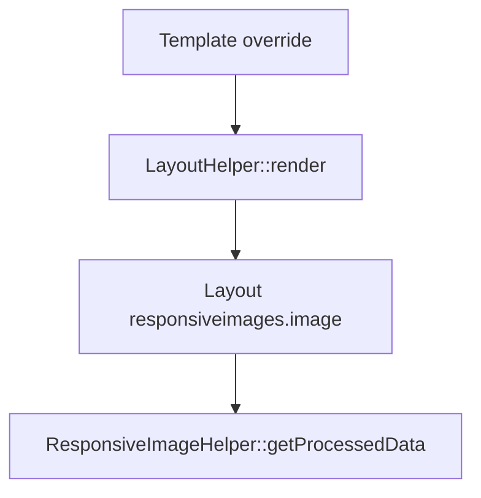

# Joomla plugin responsive images


Latest release (dowload the plugin here ) 
  https://github.com/web-tiki/joomla-responsive-images/releases/latest/download/responsiveimages.zip


A high-performance **system plugin for Joomla** that generates responsive, retina-ready images with WebP / AVIF support, lazy loading, and intelligent caching. This plugin is intended for developers as it requires to create template overrides to call the plugin. Each call can be customized to create different settings. The plugins was initialy intended to work with the media custom field but it can also work with the default joomla intro or full images. 

The plugin follows **modern Joomla best practices**:
- business logic in a helper
- HTML rendering via Joomla layouts
- fully overrideable from templates

---

## 🧠 Architecture Overview

The plugin is built around **Joomla layouts**, not direct HTML output.

**Flow:**



This ensures:
- clean separation of concerns
- compatibility with Joomla 6
- easy template overrides

---

## 🛠 Usage (Template Overrides)

Use the plugin **from template overrides** (articles, modules, custom layouts).

### 1️⃣ Use `LayoutHelper` (recommended)

```php
use Joomla\CMS\Layout\LayoutHelper;
```

### 2️⃣ Basic Implementation

```php
$field = $fields['main-img'] ?? null;

echo LayoutHelper::render(
    'responsiveimages.image',
    [
        'field'   => $field,
        'options' => [
            'sizes'  => '(max-width: 600px) 100vw, 100vw',
            'widths' => [640, 900, 1280, 1920],
        ],
    ],
    JPATH_PLUGINS . '/system/responsiveimages/layouts'
);
```

---

### 3️⃣ Advanced Implementation (Full Options)

```php
echo LayoutHelper::render(
    'responsiveimages.image',
    [
        'field' => $field,
        'options' => [
            'lazy'        => true,
            'webp'        => true,
            'avif'        => true,
            'alt'         => 'Alt text',
            'sizes'       => '100vw',
            'widths'      => [640, 1280, 1920],
            'heights'     => null,
            'outputDir'   => 'thumbnails/res',
            'quality'     => 75,
            'aspectRatio' => null,
        ],
    ],
    JPATH_PLUGINS . '/system/responsiveimages/layouts'
);
```

---

## 📐 Layout System

### Default layout location

```
plugins/system/responsiveimages/layouts/
└─ responsiveimages/
   └─ image.php
```

### Template override support

```
templates/<your_template>/html/layouts/
└─ responsiveimages/
   └─ image.php
```

---

## 🔁 Migration Notes (Old versions → Layout-based)

**Before (deprecated):**

```php
echo ResponsiveImageHelper::render($field, $options);
```

**Now (Joomla 6 compliant):**

```php
echo LayoutHelper::render(
    'responsiveimages.image',
    ['field' => $field, 'options' => $options],
    JPATH_PLUGINS . '/system/responsiveimages/layouts'
);
```

Benefits:
- Joomla-native rendering
- overrideable layouts
- no HTML in helpers

---

## 🧩 Helper API (Internal)

### `ResponsiveImageHelper::getProcessedData()`

```php
array getProcessedData(array $context)
```

**Input:**
- `field` (Joomla media field)
- `options` (array)

**Returns:**
```php
[
  'srcset'   => string,
  'fallback'=> string,
  'sizes'   => string,
  'alt'     => string,
  'webp'    => ?string,
  'avif'    => ?string,
]
```

This method **never outputs HTML**.

---

## ⚙️ Plugin Configuration

System → Manage → Plugins → System – Responsive Images

- Thumbnail directory
- Global quality
- Lazy loading default
- WebP / AVIF enablement
- Cache strategy

Per-call options always override global defaults.

---

## 📦 Joomla Extensions Directory Compliance

✔ No core overrides  
✔ No global state modification  
✔ Layout-based rendering  
✔ Namespaced PHP  
✔ Joomla 6 / PHP 8.1+ compatible  

---

## 🚀 Releasing a New Version

1. Update versions:
   - `update.xml`
   - `responsiveimages.xml`

2. Commit & push to `main`

3. Tag the release:
```powershell
git tag v0.0.3
git push origin v0.0.3
```

GitHub Actions will publish the ZIP automatically.

---

## 🔗 Links

- Update server  
  https://raw.githubusercontent.com/web-tiki/joomla-responsive-images/main/update.xml

- Latest release (dowload the plugin here ) 
  https://github.com/web-tiki/joomla-responsive-images/releases/latest/download/responsiveimages.zip

---

Developed by [web-tiki](https://web-tiki.com/)
